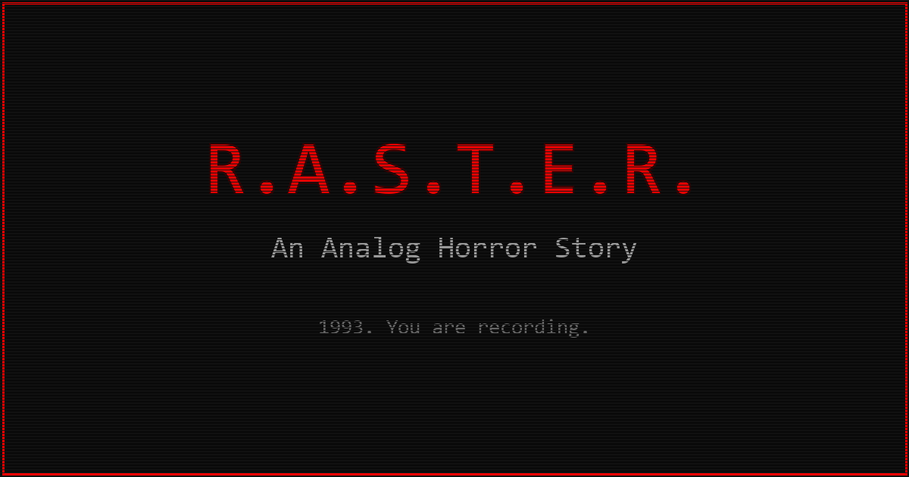

# SOMEWHERE - An Analog Horror Story
**Website Repository**

A Flask-powered landing page for SOMEWHERE, an AI-powered analog horror narrative experience delivered through Discord.



---

## 🎥 About SOMEWHERE

SOMEWHERE is an interactive analog horror experience where every decision is recorded. Play as Jason Fleece, an investigative journalist entering a classified desert facility in 1993. Every frame is AI-generated in real-time. The story reacts to what you do — and the tape never lies.

**Key Features:**
- 🎥 Every frame AI-generated by Google Gemini
- 🎮 Choice-based narrative with real consequences
- 📼 Downloadable VHS-style playthrough
- 💀 Permadeath - no second chances
- 🕰️ Time pressure - hesitation has consequences
- 🎲 Fate system adds unpredictability

---

## 🚀 Quick Start

### Prerequisites
- Python 3.11+
- pip
- Virtual environment (recommended)

### Installation

1. **Clone the repository**
```bash
git clone https://github.com/yourusername/somewhere-website.git
cd somewhere-website
```

2. **Create virtual environment**
```bash
python -m venv venv

# Windows
venv\Scripts\activate

# macOS/Linux
source venv/bin/activate
```

3. **Install dependencies**
```bash
pip install -r requirements.txt
```

4. **Set up environment variables**

Create a `.env` file in the root directory:

```bash
DISCORD_INVITE=https://discord.gg/YOUR_INVITE_CODE
SECRET_KEY=your-secret-key-here-change-in-production
FLASK_ENV=development
```

5. **Run the development server**
```bash
python app.py
```

Visit `http://localhost:5000` in your browser.

---

## 📁 Project Structure

```
somewhere-website/
├── app.py                      # Main Flask application
├── config.py                   # Configuration management
├── requirements.txt            # Python dependencies
├── .env.example               # Environment variables template
├── Procfile                    # Heroku deployment
├── render.yaml                 # Render.com deployment
├── runtime.txt                 # Python version
├── static/
│   ├── css/
│   │   └── style.css          # VHS aesthetic styling
│   ├── js/
│   │   └── main.js            # Minimal interactivity
│   ├── images/
│   │   ├── favicon.ico        # Browser icon
│   │   ├── og-image.png       # Social media preview
│   │   └── examples/          # Gameplay screenshots
│   │       ├── example1.png
│   │       ├── example2.png
│   │       ├── example3.png
│   │       └── example4.png
│   └── fonts/                 # Custom fonts (optional)
└── templates/
    ├── base.html              # Base template
    └── index.html             # Landing page
```

---

## 🎨 Design Philosophy

### VHS Analog Horror Aesthetic
- **Colors**: Dark theme with VHS red (#FF0033) and phosphor green (#00FF41) accents
- **Typography**: Monospace (JetBrains Mono) for headings, clean sans-serif (Inter) for body
- **Effects**: Subtle scan lines, CRT glow, minimal glitch effects on hover
- **Performance**: Fast loading, mobile-first, accessibility-focused

### Conversion-Focused
- **Primary Goal**: Get visitors to click Discord invite button
- **Copy Strategy**: Focus on agency and consequence, not technology
  - "You can do anything — and you might not survive it"
  - Short, direct sentences
  - No tech jargon on landing page

### Reference Inspiration
- **Midjourney's landing page** - Clean, minimal, bold
- **1993 VHS tapes** - Authentic analog aesthetic
- **AI Dungeon** - Conversion-focused structure

---

## 🌐 Deployment

### Option 1: Render.com (Recommended)

1. **Push to GitHub**
```bash
git init
git add .
git commit -m "Initial commit"
git remote add origin https://github.com/yourusername/somewhere-website.git
git push -u origin main
```

2. **Deploy to Render**
   - Go to [Render.com](https://render.com)
   - Click "New +" → "Web Service"
   - Connect your GitHub repository
   - Render will auto-detect `render.yaml`
   - Set environment variable `DISCORD_INVITE` in dashboard
   - Click "Create Web Service"

3. **Custom Domain (Optional)**
   - Go to Settings → Custom Domain
   - Add your domain and configure DNS

**Cost**: Free tier available (with limitations), ~$7/month for standard plan

### Option 2: Heroku

1. **Install Heroku CLI**
```bash
# macOS
brew install heroku/brew/heroku

# Windows
# Download from https://devcenter.heroku.com/articles/heroku-cli
```

2. **Deploy**
```bash
heroku login
heroku create somewhere-website
git push heroku main
heroku config:set DISCORD_INVITE=https://discord.gg/YOUR_INVITE_CODE
heroku config:set SECRET_KEY=your-secret-key-here
heroku open
```

### Option 3: Vercel (Static Export)

For static deployment, you can export Flask as static HTML:

```bash
pip install flask-frozen
python freeze.py  # Create freeze script
vercel deploy
```

---

## 🖼️ Adding Gameplay Images

To add example images from your Discord bot:

1. **Export images** from your bot's cache:
```bash
# Copy 4 good example frames
cp path/to/bot/cache/frame_001.png static/images/examples/example1.png
cp path/to/bot/cache/frame_045.png static/images/examples/example2.png
cp path/to/bot/cache/frame_089.png static/images/examples/example3.png
cp path/to/bot/cache/frame_120.png static/images/examples/example4.png
```

2. **Optimize images** for web:
```bash
# Install ImageMagick
brew install imagemagick  # macOS
# or download from https://imagemagick.org

# Resize to max 800px wide
magick static/images/examples/*.png -resize 800x static/images/examples/optimized_%03d.png
```

3. **Update captions** in `templates/index.html`:
```html
<p class="gallery-caption">Your custom caption here</p>
```

---

## 🔧 Configuration

### Environment Variables

| Variable | Description | Required | Default |
|----------|-------------|----------|---------|
| `DISCORD_INVITE` | Discord server invite link | ✅ Yes | None |
| `SECRET_KEY` | Flask secret key | ✅ Yes | `dev-key-change-in-production` |
| `FLASK_ENV` | Environment (`development`/`production`) | No | `production` |
| `BOT_STATE_FILE` | Path to bot state.json (Phase 2+) | No | None |
| `BOT_CACHE_DIR` | Path to bot cache directory (Phase 2+) | No | None |

### Customization

**Change Colors:**
Edit `static/css/style.css` → `:root` variables

**Change Fonts:**
Edit `templates/base.html` → Google Fonts link
Edit `static/css/style.css` → `--font-mono` and `--font-sans`

**Change Copy:**
Edit `templates/index.html` → Update text content

**Disable Effects:**
Set `--scanline-opacity: 0;` in `static/css/style.css`

---

## 🚦 Development Phases

### ✅ Phase 1: Landing Page (Current)
- Static landing page with VHS aesthetic
- Discord invite CTA
- Example gameplay images
- Mobile-responsive design

### 🔜 Phase 2: Live Stats & Gallery (Future)
- Real-time stats from Discord bot
- Live gallery of recent generated images
- API endpoints for bot integration

### 🔮 Phase 3: Full Web UI (Future Vision)
- Play from browser (alternative to Discord)
- User accounts and profiles
- Tape library and sharing
- Leaderboards and community features

---

## 🧪 Testing

### Run Tests
```bash
# Install test dependencies
pip install pytest pytest-flask

# Run tests
pytest tests/
```

### Manual Testing Checklist
- [ ] Homepage loads in < 2 seconds
- [ ] All images load correctly
- [ ] Discord invite link works
- [ ] Mobile responsive (test on phone)
- [ ] VHS effects render properly
- [ ] No console errors in browser
- [ ] Scanlines visible but subtle
- [ ] Buttons have hover effects
- [ ] Accessibility: keyboard navigation works

### Browser Compatibility
Tested on:
- ✅ Chrome 120+
- ✅ Firefox 120+
- ✅ Safari 17+
- ✅ Edge 120+

---

## 📊 Analytics (Optional)

To add Google Analytics:

1. **Get tracking ID** from Google Analytics

2. **Add to `templates/base.html`** before `</head>`:
```html
<!-- Google Analytics -->
<script async src="https://www.googletagmanager.com/gtag/js?id=G-XXXXXXXXXX"></script>
<script>
  window.dataLayer = window.dataLayer || [];
  function gtag(){dataLayer.push(arguments);}
  gtag('js', new Date());
  gtag('config', 'G-XXXXXXXXXX');
</script>
```

3. **Track button clicks** in `static/js/main.js`:
```javascript
gtag('event', 'cta_click', {
  'event_category': 'engagement',
  'event_label': buttonText
});
```

---

## 🐛 Troubleshooting

### Images not loading
- Check file paths in `static/images/examples/`
- Verify file names match those in `templates/index.html`
- Check file permissions (should be readable)

### Styles not applying
- Hard refresh browser (Ctrl+F5 / Cmd+Shift+R)
- Check browser console for CSS errors
- Verify `static/css/style.css` exists

### Discord invite not working
- Check `DISCORD_INVITE` environment variable
- Verify invite link hasn't expired
- Test link in incognito window

### Server won't start
- Check Python version: `python --version` (should be 3.11+)
- Verify all dependencies installed: `pip list`
- Check for port conflicts: `lsof -i :5000` (macOS/Linux)

---

## 🤝 Contributing

This is a single-purpose landing page. Major changes should be discussed first.

### Code Style
- Python: Follow PEP 8
- HTML: Semantic, accessible markup
- CSS: BEM naming convention
- JavaScript: ES6+, vanilla JS (no frameworks)

### Pull Request Process
1. Fork the repo
2. Create feature branch (`git checkout -b feature/improvement`)
3. Commit changes (`git commit -m "Add improvement"`)
4. Push to branch (`git push origin feature/improvement`)
5. Open Pull Request

---

## 📄 License

Copyright © 2025 SOMEWHERE. All rights reserved.

---

## 🔗 Links

- **Discord**: [Join Server](https://discord.gg/YOUR_INVITE_CODE)
- **Game Info**: [About SOMEWHERE](#)
- **Technical Docs**: [Wiki](#)

---

## 📞 Support

Questions or issues? Contact:
- Discord: [Your Discord Server](https://discord.gg/YOUR_INVITE_CODE)
- Email: support@somewhere.com
- Issues: [GitHub Issues](https://github.com/yourusername/somewhere-website/issues)

---

**Built with ❤️ for the horror game community**

*"1993. You are recording. The world does not care if you survive."*


